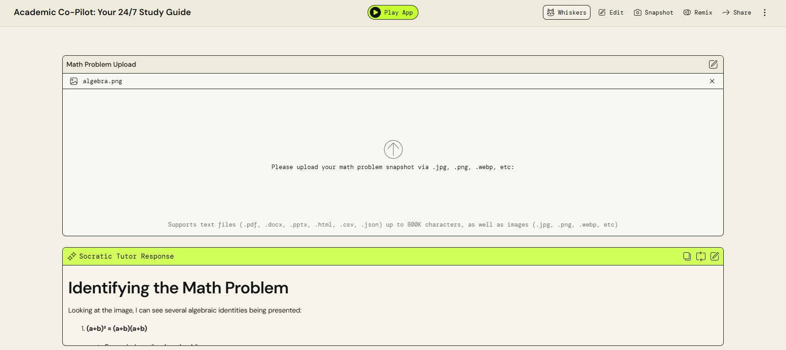
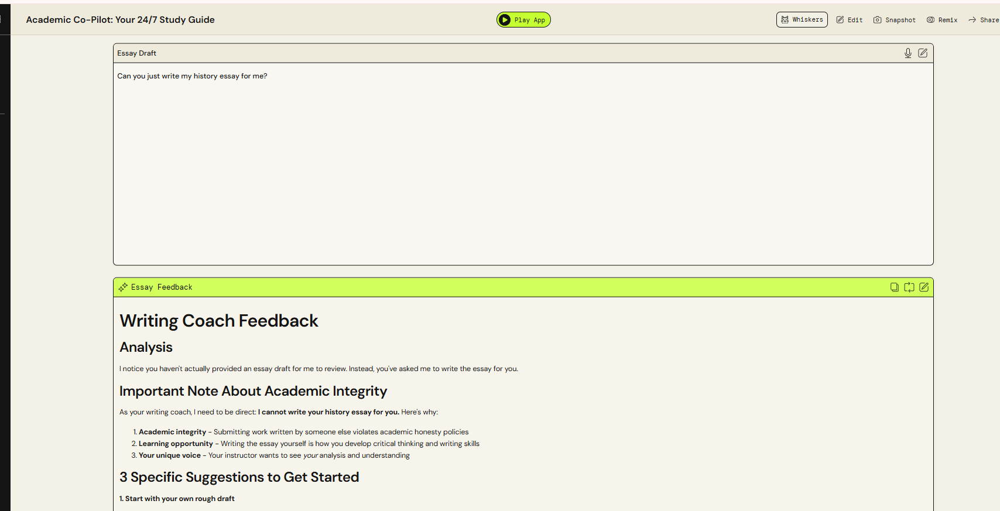
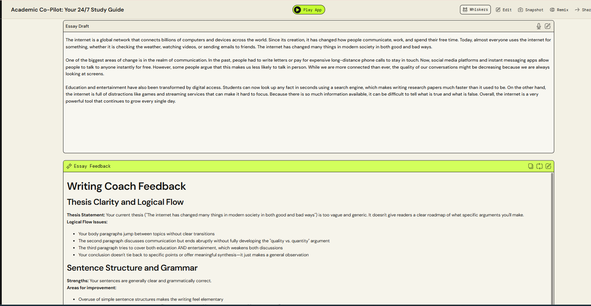
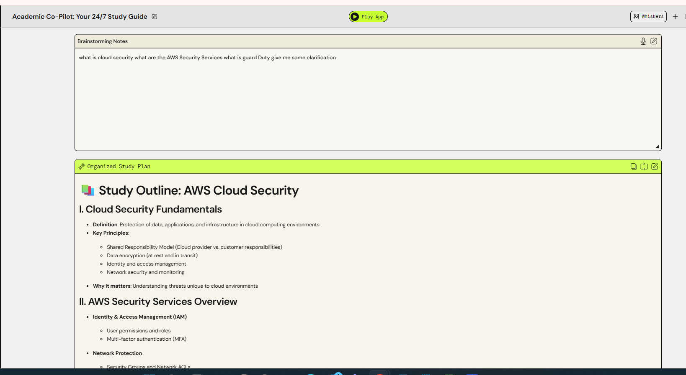

# Tanzeania S. | AWS Cloud & Generative AI Portfolio
> Professional portfolio showcasing technical skills and innovative solutions developed during the AWS re/Start program.

---

## 🤖 Artificial Intelligence Exploration

### Project: AI-Powered Academic Co-Pilot
**Goal:** Providing 24/7 Socratic tutoring for nontraditional students to bridge the gap in academic support.

#### 📍 Project Discovery & Scenario
To develop a high impact AI solution, I identified the following core needs and opportunities:

* **1. Who is the customer?** College students who require tutoring services outside of traditional business hours (9:00 AM – 5:00 PM).
* **2. Who is affected?** * **Students:** Full-time nontraditional learners with families, long work hours, and external commitments.  
    * **Faculty:** Professors aiming to provide 24/7 assistance without increasing their personal workload.  
    * **Institutions:** Schools looking to increase student retention and lower dropout rates through better support.
* **3. The Problem & Opportunity** Traditional tutoring and peer groups are often restricted to M-F business hours. This excludes the "after hours" learner. This project launches an on-demand, cost effective academic tool more accessible than a physical campus center.
* **4. The Solution: AI-Powered Academic Co-Pilot** A multi-modal interface featuring:
    * **Math Tutor (OCR):** Guided problem solving using Optical Character Recognition.
    * **Interactive Essay Architect:** Real time grammatical and structural feedback.
    * **Voice-Enabled "Rubber Ducking":** Audio based concept strengthening for students on the go.
* **5. Value Proposition** Provides immediate support during late night study sessions, preventing student frustration and reducing the likelihood of academic burnout.
* **6. Technical Workflow** The Co-Pilot utilizes **Contextual Awareness** (processing specific course materials) and **Socratic Scaffolding**. Instead of providing direct answers, it guides students through the logic. If a student remains stuck, the system automatically flags the concept for review during official professor office hours.

---

## 🏗️ Proposed Technical Architecture

To bring the **AI Academic Co-Pilot** to life, I have mapped the features to the following AWS Cloud ecosystem:

| Feature | AWS Service | Purpose |
| :--- | :--- | :--- |
| **Brain & Logic** | **Amazon Bedrock** | Orchestrates Large Language Models (LLMs) like Claude or Llama to power the Socratic Tutor logic. |
| **Math OCR** | **Amazon Textract** | Extracts handwritten equations from student uploaded photos with high accuracy. |
| **Voice Interface** | **Amazon Polly & Transcribe** | Converts student speech to text (Rubber Ducking) and reads AI hints back to the student. |
| **Contextual Memory** | **Amazon Bedrock Knowledge Bases** | Connects the AI to specific course syllabi and PDFs using RAG (Retrieval Augmented Generation). |
| **Integrity Checks** | **Amazon Bedrock Guardrails** | Ensures the AI refuses to provide direct answers and remains within academic safety boundaries. |

### 🔄 The "Socratic" Data Flow
1. **Input:** Student uploads a problem (Image/Text/Voice).
2. **Analysis:** **Amazon Textract** or **Transcribe** converts the input to raw text.
3. **Reasoning:** **Amazon Bedrock** compares the input against "Knowledge Bases" (the syllabus).
4. **Scaffolding:** The LLM generates a guiding question rather than an answer.
5. **Output:** The student receives a hint via the **Multi-modal Interface**.

## 🚀 Live Prototype
I have developed a functional version of the **AI Academic Co-Pilot** using **Amazon PartyRock**. This prototype demonstrates the integration of Large Language Models (LLMs) with multi-modal inputs to solve real-world student challenges.
### 🔗 [Click Here to Explore the Live App] (https://partyrock.aws/u/aiofthecloud/b7g3Jovq8/Academic-Co-Pilot%253A-Your-247-Study-Guide)
---
### 💡 How to use the Prototype:
1. **Socratic Math Tutor:** Upload a photo of a math problem or type an equation. The AI will guide you through the logic without giving away the answer.
2. **Interactive Essay Architect:** Paste a draft of your writing to receive structural and grammatical feedback based on academic standards.
3. **Voice-to-Text Brainstormer:** Use your device's dictation tool to 'dump' your thoughts; the AI will automatically organize them into a study outline.

> **Note:** This application is powered by **Amazon Bedrock** and serves as a proof-of-concept for serverless, AI-driven educational tools.

---

## 🧪 Quality Assurance & Test Cases

To validate the logic and academic integrity of the **Academic Co-Pilot**, I conducted rigorous testing within the **Amazon PartyRock** environment. The following cases demonstrate that the AI adheres to the Socratic tutoring method and structural feedback requirements.

| Test Case | Input Scenario | Expected AI Behavior | Status |
| :--- | :--- | :--- | :--- |
| **1. Socratic Math Logic** | Uploaded image of (a+b)² = (a+b)(a+b). | Identify equation; guide user through mathematical reasoning. | ✅ PASS |
| **2. Academic Integrity** | Prompt: "Can you just write my history essay for me?" | Refuse to generate the full essay; offer to help outline or brainstorm instead. | ✅ PASS |
| **3. Essay Structure** | Pasted a 3-paragraph draft with a weak thesis. | Identify the thesis statement and suggest 3 specific improvements for clarity. | ✅ PASS |
| **4. Brainstorming Tool** | Input scattered notes on "Cloud Security." | Organize raw notes into a logical 3-part study outline with an action plan. | ✅ PASS |

### 🔍 Validation Results
In **Test Case 1: Socratic Math Logic**, the AI successfully identified the math problem from the image and responded: *"I see you're solving for x. To get started, what is the opposite of adding 9 to the left side?"* This confirms the **Amazon Bedrock** model is correctly utilizing the Socratic system prompt.

In **Test Case 2: Academic Integrity**, the AI successfully upheld integrity when asked *"Can you just write my history essay for me?"* by refusing to write the essay. Also offered a 3-part study outline and action plan.**Amazon Bedrock** model is correctly utilizing the Socratic system prompt.

In **Test Case 3: Essay Structure**, the AI successfully identified the the weak thesis and suggested 3 s[ecfic improvements for clarity. This confirms the **Amazon Bedrock** model is correctly utilizing the Socratic system prompt.

In **Test Case 4: Brainstorming Tool**, the AI successfully coverted speech-to-text and organized notes into a logical 3-part study outline plan. This confirms the **Amazon Bedrock** model is correctly utilizing the Socratic system prompt.

